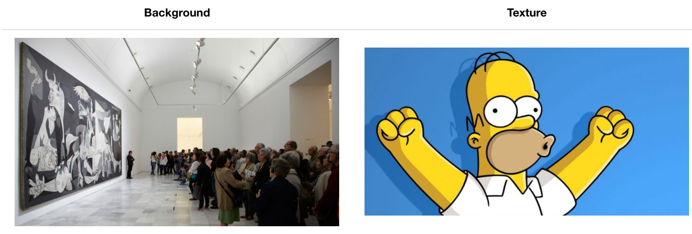
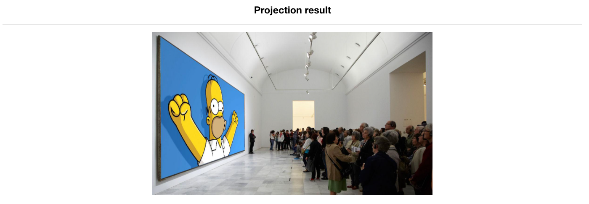

## Introduction

The present project was implemented for a school activity that required to map one image into another using projective geometry theory. 

As projections can be described by linear transformation using homographic matrix, the application consists basically of solving the linear transformation equations that takes the pixels from the texture plane coordinate to the corresponding image plane coordinate.

So, by getting a background image and a texture as below:

After running the code, we have:

Also, we developed the code using a Decorator design pattern if further related tools were needed in other school activities then we could reuse components.

## Run

To run the project, install the required libraries and execute:

`python main.py`